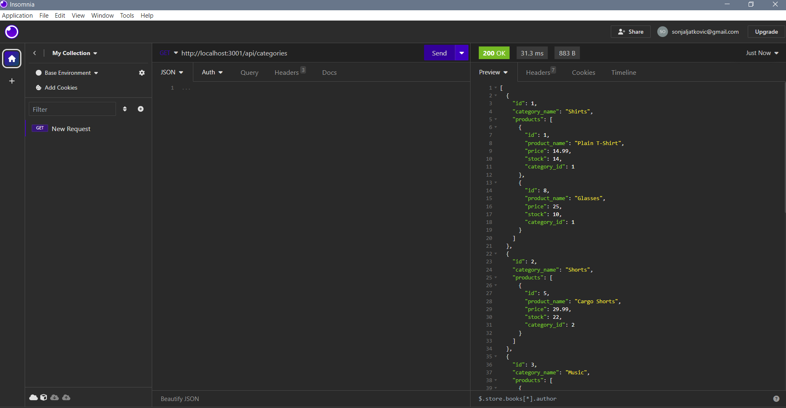
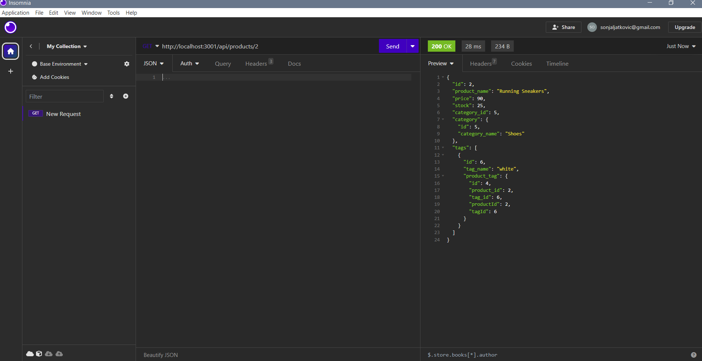
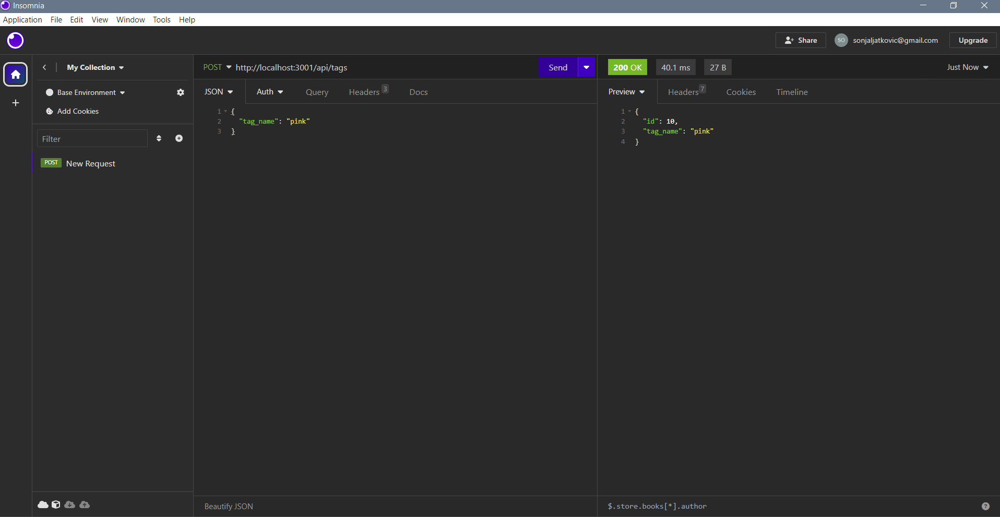
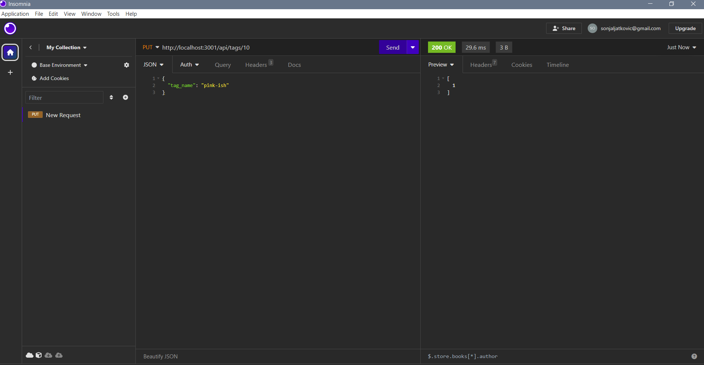
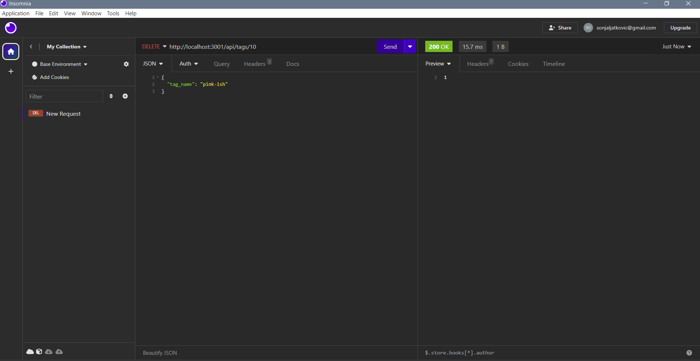

# E-Commerce Back End

## Description
This is the back end for an e-commerce site. It allows the user to see all the products, categories and tags.  
It also allows the user to create, update and delete products, categories and tags.  

## Installation
To use the application first run "npm i".  
After everything is installed run "mysql -u (your username) -p and enter your password.  
Run "source schema.sql" to create a database.  
And then run "npm run seed" to populate the tables.  
In the end, just run "npm start" to start the application.

## Usage
After all the installation is gone you can open Insomnia or any app that can handle API requests.  
You can make GET, POST, PUT or DELETE requests. 

Preview:  

Video walk-through:  

[E-Commerce-Back-End-Video](https://drive.google.com/file/d/1pDKC-oWrJRiQBsFAm3d5HACnVZdl-EI4/view)

## License
Please refer to the LICENSE in the repo.
